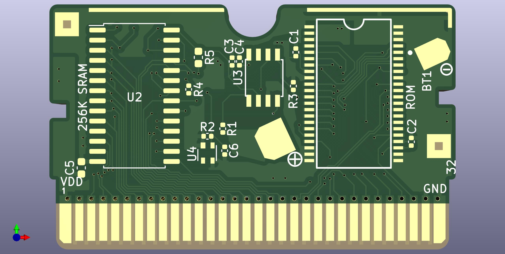
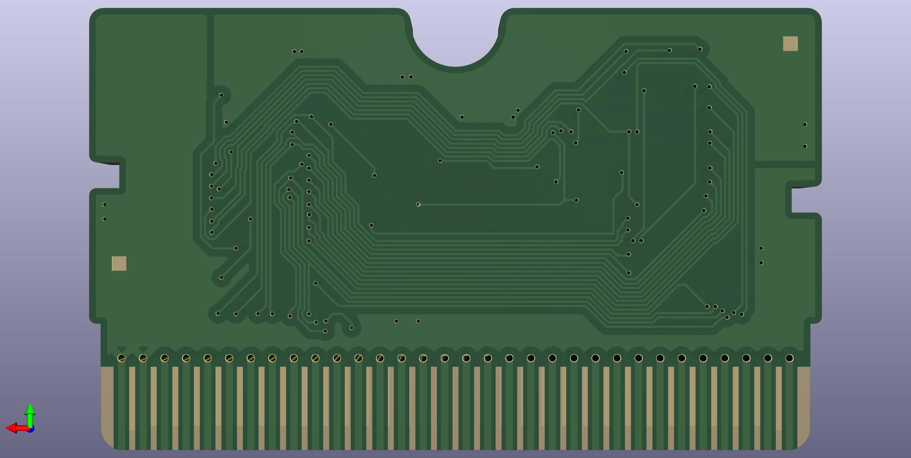

# AGB-E06-Replacement-PCB
Replacement PCB for damaged gameboy advance games using the AGB-E06 pcb
## Credits
Thanks to HDR for the symbols and footprints for the board outline, cart bus, mask rom, battery pads and a few ground pads.  
His repo can be found [here](https://github.com/HDR/NintendoPCBs).
### General Info
Please note this PCB can only be used as a replacement board for an original game.  
  
Order at 0.8mm and with ENIG, **NOT HASL**.  
### SRAM vs FRAM
***As a pretext, if your donor board has a working SRAM I would generally reccomend you simply use that and not go out of your way to get a new FRAM chip since a battery save will likely last more than long enough for most people.***  
  
  This board works with both the original save chip (SRAM) OR a replacement new part, a FM18W08 (FRAM) with the benefit of the FRAM being that a battery is not required to maintain the save. If FRAM is used, do not install a battery and populate R5 with a 10k ohm resistor (sized for 0603), this goes between pins 20 and 28 of the FM18W08 to act as a pullup resistor since the functionality of its chip enable pin is inverted compared to the original SRAM.  
  As a side note, the SRAM/FRAM footprint on the board is sized for the FM18W08 which is slightly smaller than the original SRAM, although I haven't had any trouble getting the original SRAM on. 
### BOM 
|Designator|Component|
|----------|---------|
|C1,C2,C3,C4,C6|0402 0.1uF|
|C5|0603 ?|
|R1|0402 1k|
|R2,R4|0402 100k|
|R3|0402 5k|
|R5|0603 10k|
|BT1|CR1616 Tabbed|
|U1|harvested (MX23L6406-12C)|
|U2|harvested (BS62LV256SC-70) OR FM18W08|
|U3|harvested (BU9803F)|
|U4|harvested (PST3425)|
  

